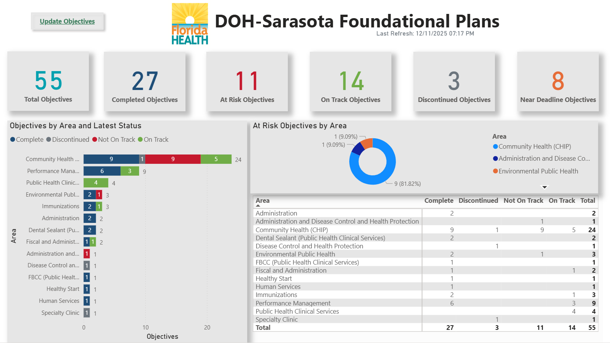
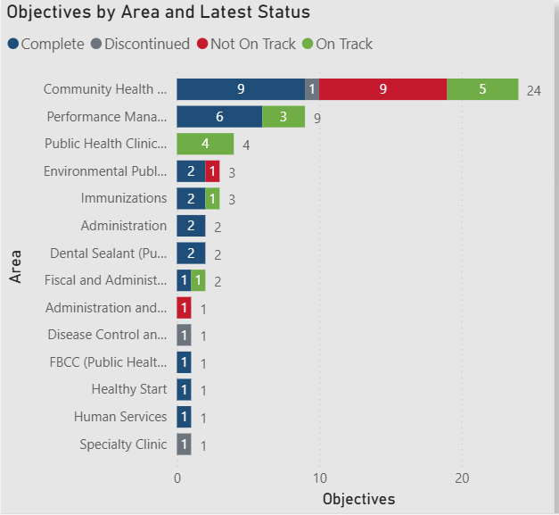
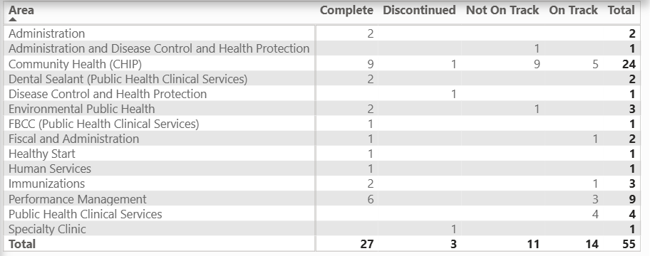
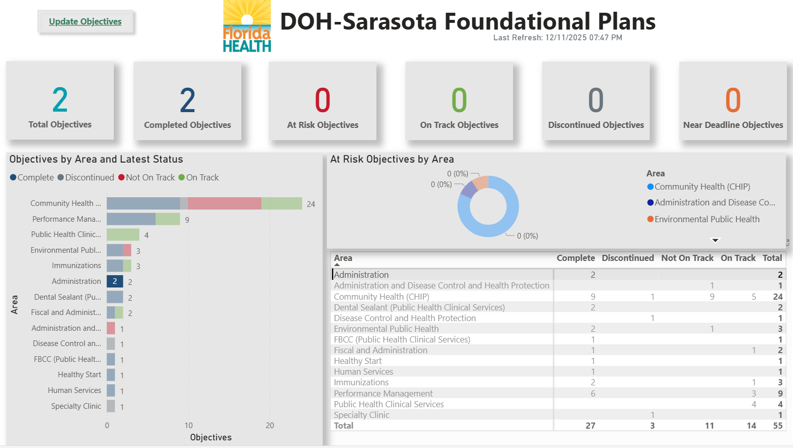
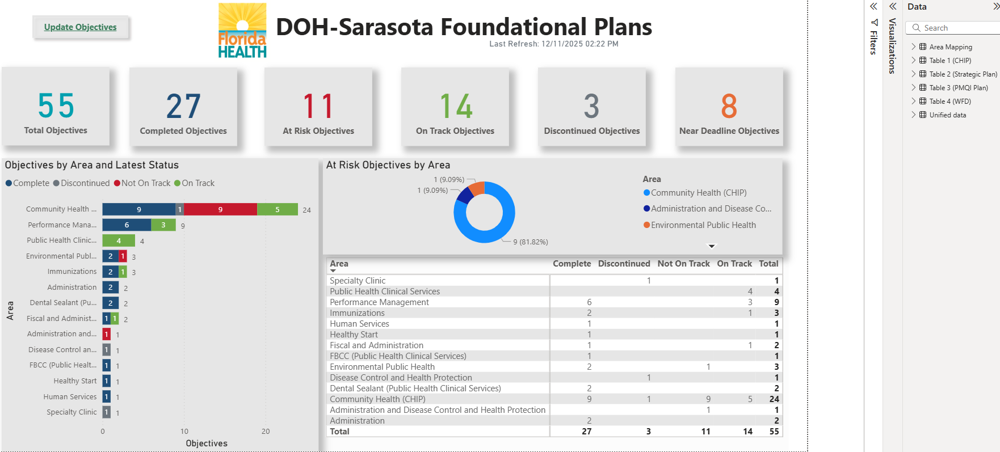

Sarasota Foundational Plans Dashboard  
Florida Department of Health – Sarasota County

This repository contains a Power BI dashboard developed to support the Sarasota County Foundational Plans monitoring process.  
The dashboard integrates data from:

CHIP – Community Health Improvement Plan**  
Strategic Plan**  
PMQI – Performance Management & Quality Improvement**  
WFD – Workforce Development**

## Dashboard Overview

## KPI Cards

## Bar Chart

## Line Chart

## Filters & Slicers – Community Health

## Filters & Slicers – Administration

## Data Model (Model View)

---

## 🛠️ Technologies Used

- Power BI Desktop  
- Power Query (M)  
- DAX  
- SharePoint Integration  
- Data Modeling (Star Schema)

---

## 📁 Files in This Repository

- `Found Plans.pbix` – Power BI dashboard file  
- `/images` – Dashboard screenshots  
- `README.md` – Documentation  

---

## 🔗 Public Dashboard Link

**Power BI Service (public org share):**  
👉 [Dashboard Link](https://app.powerbigov.us/view?r=eyJrIjoiZWU3NGUwYzEtYmViNy00ZTZlLWI0NWUtODE3YjhhNjBmYzFlIiwidCI6IjI4Y2Q4ZjgwLTNjNDQtNGIyNy04MWEwLWNkMmIwM2EzMWI4ZCJ9)

---

## 📝 Notes

This public version does not contain any confidential data and complies with organizational data governance.

